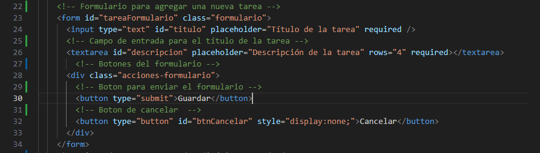
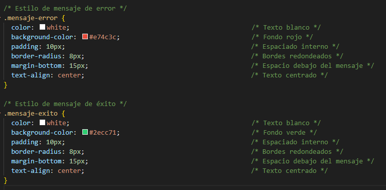

# Documentación del Proyecto

## Paso 1: Configurar MongoDB Atlas
- **Descripción**: Crea una cuenta en MongoDB Atlas, configura el acceso a la base de datos y obtén la URI de conexión.
- **Capturas de pantalla**:
  - 
  - 
  - 
  - 

## Paso 2: Instalar y Configurar MongoDB Compass
- **Descripción**: Descarga e instala MongoDB Compass y conéctate a MongoDB Atlas.
- **Capturas de pantalla**:
  - 
  - 

## Paso 3: Configurar el Proyecto en VS Code
- **Descripción**: Crea un nuevo proyecto en VS Code e instala las dependencias necesarias.
- **Capturas de pantalla**:
  - 

## Paso 4: Configurar la Conexión a MongoDB
- **Descripción**: Crea el archivo `.env` y el archivo `database.js` para configurar la conexión a MongoDB.
- **Capturas de pantalla**:
  - 
  - 

## Paso 5: Definir el Modelo de Tarea
- **Descripción**: Crea el archivo `task.model.js` para definir el modelo de tarea.
- **Capturas de pantalla**:
  - 

## Paso 6: Inicializar el Repositorio en GitHub
- **Descripción**: Crea un nuevo repositorio en GitHub y configura Git en tu proyecto.
- **Comandos Git**: git init
                    git add .
                    git commit -m "Initial commit: Database setup and task model"
                    git branch -M main
                    git remote add origin URL_DEL_REPOSITORIO#cambiar esto con lo del repo
                    git push -u origin main
- **Capturas de pantalla**:
  - 
  - 

## Paso 7: Probar la Conexión y el Modelo
- **Descripción**: Crea un archivo `test.js` y ejecútalo para probar la conexión y el modelo.
- **Capturas de pantalla**:
  - 
  - 

## Paso 8: Implementar el Endpoint GET `/tareas`
- **Descripción**: Implementa el endpoint para obtener todas las tareas de la base de datos.
- **Capturas de pantalla**:
  - 
  - 
  - 
  - 

## Paso 9: Implementar el Endpoint POST `/tareas`

- **Descripción**: Implementa el endpoint POST `/tareas` para crear nuevas tareas en la base de datos.
- **Controlador**: Se actualizó el archivo `tasks.controller.js` para incluir la función `createTask`, que valida los datos de entrada y guarda una nueva tarea en la base de datos.
  - **Capturas de pantalla**:
    - 
- **Rutas**: Se modificó el archivo `tasks.routes.js` para incluir el nuevo endpoint POST `/tareas`.
  - **Capturas de pantalla**:
    - 
- **Middleware**: Se aseguró que `app.js` tenga el middleware `express.json()` para parsear el cuerpo de las solicitudes.
  - **Capturas de pantalla**:
    - 
- **Pruebas con Postman**: Se realizó una solicitud POST a `http://localhost:3000/api/tareas` para verificar que el endpoint funciona correctamente.
  - **Capturas de pantalla**:
    - 

## Paso 10: Implementar el Endpoint PUT `/tareas/:id`

- **Descripción**: Implementa el endpoint PUT `/tareas/:id` para actualizar tareas existentes en la base de datos.
- **Controlador**: Se actualizó el archivo `tasks.controller.js` para incluir la función `updateTask`, que busca una tarea por su ID, actualiza los campos proporcionados y guarda los cambios en la base de datos.
  - **Capturas de pantalla**:
    - 
- **Rutas**: Se modificó el archivo `tasks.routes.js` para incluir el nuevo endpoint PUT `/tareas/:id`.
  - **Capturas de pantalla**:
    - 
- **Ejecutar servidor**: Se ejecuto `app.js` para que se ejecutara el servidor.
  - **Capturas de pantalla**:
    - 
- **Pruebas con Postman**: Se realizó una solicitud PUT a `http://localhost:3000/api/tareas/ID_DE_LA_TAREA` para verificar que el endpoint funciona correctamente.
  - **Capturas de pantalla**:
    - 

## Paso 11: Implementar el Endpoint DELETE `/tareas/:id`

- **Descripción**: Implementa el endpoint DELETE `/tareas/:id` para eliminar tareas existentes de la base de datos.
- **Controlador**: Se actualizó el archivo `tasks.controller.js` para incluir la función `deleteTask`, que busca y elimina una tarea por su ID.
  - **Capturas de pantalla**:
    - 
- **Rutas**: Se modificó el archivo `tasks.routes.js` para incluir el nuevo endpoint DELETE `/tareas/:id`.
  - **Capturas de pantalla**:
    - 
- **Pruebas con Postman**: Se realizó una solicitud DELETE a `http://localhost:3000/api/tareas/ID_DE_LA_TAREA` para verificar que el endpoint funciona correctamente.
  - **Capturas de pantalla**:
    - 

## Paso 12: Implementar el Endpoint GET `/tareas/:id`

- **Descripción**: Implementa el endpoint GET `/tareas/:id` para obtener detalles específicos de una tarea existente en la base de datos.
- **Controlador**: Se actualizó el archivo `tasks.controller.js` para incluir la función `getTaskById`, que busca una tarea por su ID y devuelve sus detalles.
  - **Capturas de pantalla**:
    - 
- **Rutas**: Se modificó el archivo `tasks.routes.js` para incluir el nuevo endpoint GET `/tareas/:id`.
  - **Capturas de pantalla**:
    - 
- **Pruebas con Postman**: Se realizó una solicitud GET a `http://localhost:3000/api/tareas/ID_DE_LA_TAREA` para verificar que el endpoint funciona correctamente.
  - **Capturas de pantalla**:
    - 

## Paso 13: Implementar Emisión de Eventos WebSocket

- **Descripción**: Implementa la emisión de eventos WebSocket tras operaciones CRUD para notificar cambios en tiempo real y se modificaron `app.js` & `task.controller.js`.
- **Instalar Socket.IO**:
  - Se instaló Socket.IO para manejar la comunicación en tiempo real.
  ```bash
  npm install socket.io

## Paso 14: Despliegue en Render

- **Descripción**: Despliegue del backend en Render, configuración de variables de entorno y conexión a la base de datos remota.
- **Actualizar `package.json`**:
  - Se añadió el script `start` al archivo `package.json`.
  - **Capturas de pantalla**:
    - 
- **Crear Cuenta en Render**:
  - Se creó una cuenta en Render y se configuró un nuevo servicio web.
  - **Capturas de pantalla**:
    - 
- **Configurar Variables de Entorno**:
  - Se configuraron las variables de entorno en Render para la conexión a MongoDB Atlas.
  - **Capturas de pantalla**:
    - 
- **Conectar con GitHub**:
  - Se vinculó el repositorio de GitHub con Render para el despliegue continuo.
  - **Capturas de pantalla**:
    - 
- **Revisar `package.json`**:
  - Se aseguró que `package.json` tenga el script `start` para iniciar la aplicación.
- **Desplegar y Verificar**:
  - Render inició el despliegue automáticamente y se verificó la ausencia de errores en los logs.
  - **Capturas de pantalla**:
    - 

## Paso 15: Implementar acceso directo a las vistas HTML en backend. 

- **Descripción**: implementar en el backend/app.js para permitir el acceso directo a las vistas HTML.
Asegura que el archivo index.html este disponible mediante una ruta accesible desde el navegador.
- **Actualizar `app.js`**:
  - Se añadieron Configuracion CORS para permitir peticiones al archivo, servir archivos estaticos y rutasv para servir index.html directamente.
  - **Capturas de pantalla**:
    - 

## Paso 16: Crear `main.js`. 

- **Descripción**: El archivo main.js se encarga de manejar toda la lógica de interacción entre el DOM, la API REST y los WebSockets.
- **Crear conexion WebSocket**:
  - Se establece una conexión con el servidor backend utilizando socket.io-client.
  - **Capturas de pantalla**:
    - 
- **conexion Render**:
  - La URL utilizada corresponde a la dirección pública del backend desplegado en Render.
  - **Capturas de pantalla**:
    - 
- **Crear funcion cargar tareas desde el backend**:
  - Esta función se ejecuta al iniciar la aplicación. Hace una solicitud GET al endpoint /api/tareas utilizando fetch.
  - **Capturas de pantalla**:
    - 
- **Función para agregar tarea visualmente**:
  -  Permite mostrar una nueva tarea en la lista sin recargar la página.
  - **Capturas de pantalla**:
    - 
  - Se crea un elemento li con el nombre de la tarea y botones para editar y eliminar.
  - **Capturas de pantalla**:
    - 
- **Funciones para actualizar y eliminar del DOM**:
  -  Estas funciones se encargan de modificar o eliminar visualmente una tarea en la interfaz cuando se detecta una actualización o eliminación desde el servidor.
  - **Capturas de pantalla**:
    - 
- **Escuchar eventos del servidor vía WebSocket**:
  -  Se escuchan eventos emitidos por el backend cuando una tarea es agregada, actualizada o eliminada.
  - **Capturas de pantalla**:
    - 

## Paso 17: Interfaz de `index.html`. 

- **Descripción**:Esta interfaz permite al usuario agregar nuevas tareas mediante un formulario, así como visualizar mensajes de éxito o error.
- **Estructura del `index.html`**:
  -  El archivo HTML Utiliza clases CSS , un formulario con campos validados, y zonas para mostrar mensajes al usuario.
  - **Capturas de pantalla**:
    - 
- **Formulario para ingresar tareas**:
  - El formulario contiene un campo para el título, una descripción y botones para guardar o cancelar. Los campos son requeridos (required) para asegurar que el usuario no envíe tareas vacías.
  - **Capturas de pantalla**:
    - 
- **Manejo de mensajes de éxito y error**:
  -  Son contenedores ocultos que permiten mostrar visualmente según el resultado de la operación.
  - **Capturas de pantalla**:
    - 
- **Escuchar eventos del servidor vía WebSocket**:
  -  Se importa el cliente de Socket.IO directamente desde el servidor desplegado en Render, y se enlaza el archivo main.js para gestionar eventos.
  - **Capturas de pantalla**:
    - 

## Paso 18: Crear interfaz con CSS`. 

- **Descripción**: Se aplica una hoja de estilos externa (style.css) para mejorar la presentación visual de la aplicación.
- **Estilo base y fondo de la página**:
  - **Capturas de pantalla**:
    - 
- **Contenedor del formulario**:
  - **Capturas de pantalla**:
    - 
- **Manejo de mensajes de éxito y error**:
  - **Capturas de pantalla**:
    -   
- **Botones de editar y eliminar dentro de las tareas**:
  - **Capturas de pantalla**:
    -  

## Paso 19: Pruebas de Funcionalidad. 

- **Descripción**:Se realizaron pruebas para verificar el funcionamiento de la aplicación de tareas. Estas validaciones comprueban tanto la lógica del backend como la interacción en el frontend.
- **Prueba 1: Crear una Nueva Tarea**:
  -  Validar que se puede agregar una tarea correctamente.
  - **Capturas de pantalla**:
    - 
- **Prueba 2: Editar una Tarea**:
  -  Validar que se puede Editar una tarea correctamente.
  - **Capturas de pantalla**:
    - 
  - **Capturas de pantalla**:
    - 
- **Prueba 3: Eliminar una Tarea**:
  -  Validar que se puede Eliminar una tarea correctamente
  - **Capturas de pantalla**:
    - 

## Paso 20: Configurar la URL del Backend. 

- **Descripción**:Para facilitar el cambio entre entornos de desarrollo local y produccion, se centralizo la URL base del backend en una constante URL_API. Esta constante se utiliza tanto para las peticiones HTTP (fetch) como para la conexión WebSocket.
  - **Capturas de pantalla**:
    - 
  